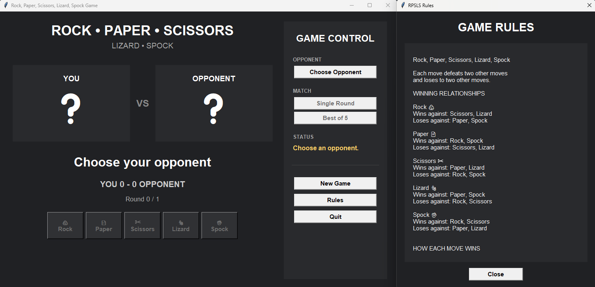
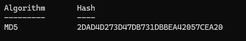

# Rock, Paper, Scissors, Lizard, Spock

A Python desktop implementation of **Rock, Paper, Scissors, Lizard, Spock** with a graphical user interface built using Tkinter.

## Overview

This project is a modernised version of an earlier Rock, Paper, Scissors, Lizard, Spock terminal game I built while learning Python.

The project has since been rebuilt as a desktop GUI application with:

* Object-oriented game and player classes
* Multiple computer opponent strategies
* Single-round and Best of 5 matches
* Animated move selection
* Score and round tracking
* Read-only rules window
* Enabled and disabled controls based on game state
* Windows executable packaging with PyInstaller

The project is primarily a learning exercise focused on applying Python programming concepts to a complete interactive application.

---

## Game Rules

Each move defeats two other moves and loses to two other moves.

| Move        | Beats            | Loses To         |
| ----------- | ---------------- | ---------------- |
| 🪨 Rock     | Scissors, Lizard | Paper, Spock     |
| 📄 Paper    | Rock, Spock      | Scissors, Lizard |
| ✂️ Scissors | Paper, Lizard    | Rock, Spock      |
| 🦎 Lizard   | Paper, Spock     | Rock, Scissors   |
| 🖖 Spock    | Rock, Scissors   | Paper, Lizard    |

### How Each Move Wins

* Rock crushes Scissors
* Rock crushes Lizard
* Paper covers Rock
* Paper disproves Spock
* Scissors cuts Paper
* Scissors decapitates Lizard
* Lizard eats Paper
* Lizard poisons Spock
* Spock smashes Rock
* Spock vaporises Scissors

### Draw

If both players select the same move, the round is a draw.

No player receives a point.

### Scoring

* Round winner: 1 point
* Round loser: 0 points
* Draw: 0 points

A **Best of 5** match consists of five rounds. The player with the highest score at the end of the match wins.

---

## Opponent Strategies

The game includes four computer-controlled opponent strategies.

### Rock

Always selects Rock.

### Random

Randomly selects one of the five available moves.

### Reflect

Copies the player's previous move.

The first move defaults to Rock because there is no previous move to copy.

### Cycle

Cycles through the five moves in order:

```text
Rock → Paper → Scissors → Lizard → Spock
```

The cycle then repeats.

---

## GUI



---

## Windows Executable

A standalone Windows executable is provided for users who want to run the game without installing Python.

Download the ZIP file, extract it, and run:

```text
RPSLS_Game.exe
```

The application is packaged with PyInstaller.

### MD5 Hash

The MD5 hash is provided to allow the downloaded ZIP file to be checked for file integrity.

**MD5:**

```text
2DAD4D273D47DB731DBBEA42057CEA20
```


